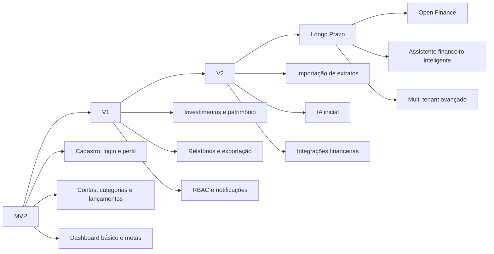
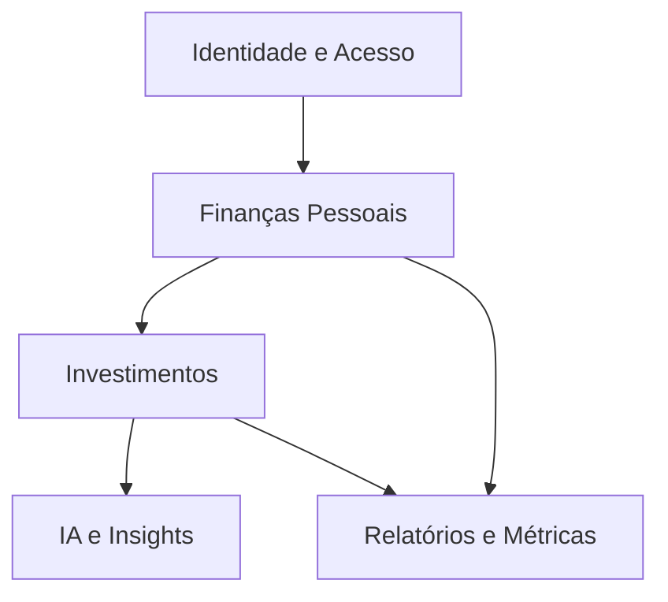
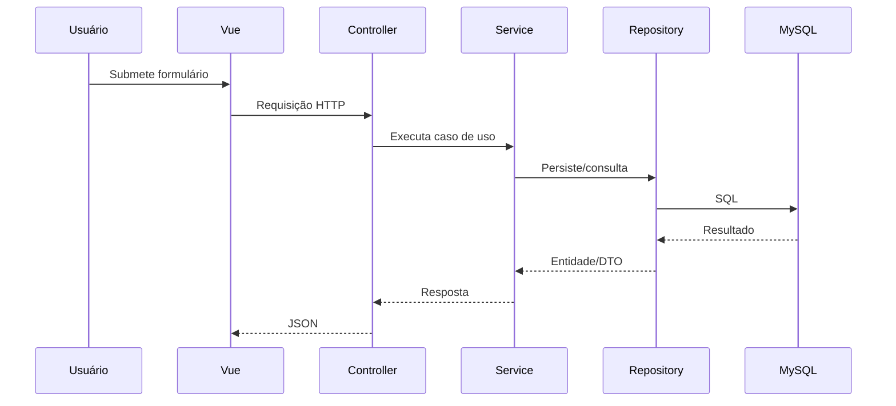
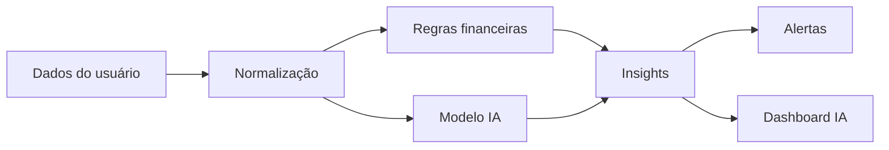

# Fidax Handbook

Documentação mestre do produto, arquitetura, domínio, API, dados, frontend, segurança, DevOps e roadmap do Fidax.

**Versão:** 1.0
**Idioma:** pt-BR
**Status:** Base estratégica e técnica

## Sumário
- [1. Visão geral do produto](#1-visão-geral-do-produto)
- [2. Requisitos funcionais](#2-requisitos-funcionais)
- [3. Requisitos não funcionais](#3-requisitos-não-funcionais)
- [4. Modelagem de domínio](#4-modelagem-de-domínio)
- [5. Modelagem do banco de dados](#5-modelagem-do-banco-de-dados)
- [6. Arquitetura do sistema](#6-arquitetura-do-sistema)
- [7. Documentação da API](#7-documentação-da-api)
- [8. Frontend](#8-frontend)
- [9. Dashboards e métricas](#9-dashboards-e-métricas)
- [10. Módulo de investimentos](#10-módulo-de-investimentos)
- [11. Módulo de IA](#11-módulo-de-ia)
- [12. Segurança](#12-segurança)
- [13. Infraestrutura e DevOps](#13-infraestrutura-e-devops)
- [14. Testes](#14-testes)
- [15. Roadmap](#15-roadmap)
- [16. Estratégia SaaS](#16-estratégia-saas)
- [17. Experiência do usuário](#17-experiência-do-usuário)
- [18. Documentação para desenvolvedores](#18-documentação-para-desenvolvedores)
- [19. Padrões de código](#19-padrões-de-código)
- [20. Futuras integrações](#20-futuras-integrações)

---

## 1. Visão geral do produto

### 1.1 Objetivo
O Fidax é uma plataforma financeira SaaS multiusuário que começa como gerenciador financeiro pessoal e evolui para consolidador de patrimônio, investimentos e inteligência financeira.

### 1.2 Problema resolvido
- Fragmentação de dados financeiros em bancos, cartões, corretoras e planilhas.
- Baixa visibilidade de fluxo de caixa, patrimônio e rentabilidade.
- Dificuldade para acompanhar metas, sonhos e planejamento.
- Falta de automação para leitura de padrões e alertas.

### 1.3 Público-alvo
| Perfil | Necessidade principal | Valor entregue |
|---|---|---|
| Iniciantes financeiros | Organizar receitas e despesas | Clareza e rotina financeira |
| Usuários de controle pessoal | Centralizar finanças | Dashboard, categorias e metas |
| Planejadores financeiros | Previsão e disciplina | Orçamento e acompanhamento |
| Investidores iniciantes | Entender carteira | Consolidação e indicadores |
| Investidores avançados | Performance e estratégia | Métricas, benchmark e insights |

### 1.4 Diferenciais
- Evolução natural de finanças pessoais para investimentos.
- Base preparada para Open Finance e integrações bancárias.
- Estrutura SaaS com suporte a múltiplos usuários e futuros tenants.
- IA orientada ao contexto financeiro do usuário.
- Arquitetura modular para expansão sem reescrita do core.

### 1.5 Proposta de valor
O Fidax entrega uma única fonte de verdade financeira para o usuário, combinando operação, análise, planejamento e inteligência.

### 1.6 Roadmap macro


### 1.7 Visão de longo prazo
- Ser a camada central de consolidação financeira do usuário.
- Ser o painel unificado de bancos, cartões, investimentos e metas.
- Evoluir para recomendação, automação e assistente financeiro conversacional.

### 1.8 Estratégia de crescimento
1. Entrar por gestão financeira pessoal.
2. Aumentar retenção com dashboards e metas.
3. Expandir para investimentos e performance.
4. Monetizar IA, integrações e recursos premium.

---

## 2. Requisitos funcionais

### 2.1 Cadastro e autenticação

#### Cadastro de usuário
- **Descrição:** criar conta para acesso à plataforma.
- **Fluxo:** preencher formulário, validar, persistir usuário, confirmar e-mail.
- **Regras:** e-mail único, senha com política forte, status inicial pendente/ativo.
- **Permissões:** público.
- **Casos de uso:** registrar conta, reenviar verificação, ativar conta.
- **Validações:** nome obrigatório, e-mail válido, senha mínima configurável.
- **Exceções:** e-mail duplicado, token expirado, conta bloqueada.

#### Login
- **Descrição:** autenticar usuário com credenciais válidas.
- **Fluxo:** informar e-mail e senha, validar, emitir sessão/token, registrar evento.
- **Regras:** limitar tentativas, expirar sessão conforme política.
- **Permissões:** público autenticável.
- **Exceções:** credenciais inválidas, conta inativa, limite excedido.

#### Recuperação de senha
- **Descrição:** permitir redefinição segura de senha.
- **Fluxo:** solicitar e-mail, enviar token, validar token, atualizar senha.
- **Regras:** token de uso único e com expiração curta.

#### 2FA futuramente
- **Descrição:** autenticação em dois fatores para contas sensíveis.
- **Regras:** opcional por plano/perfil; obrigatório para administradores.

### 2.2 Perfil e preferências
- Atualizar dados pessoais.
- Definir idioma, moeda padrão e fuso horário.
- Configurar tema claro/escuro.
- Definir preferências de notificação.

### 2.3 Multiusuário e isolamento de dados
- Cada usuário só acessa seus próprios dados.
- Registros financeiros sempre vinculados a `user_id`.
- Futuro suporte a famílias, consultorias e organizações.

### 2.4 Carteiras
- Criar, editar, listar e remover carteiras.
- Uma carteira agrupa contas, metas e visão analítica.
- Pode ser pessoal, de investimento ou temática.

### 2.5 Bancos e contas
- Cadastro de bancos/instituições.
- Cadastro de contas bancárias, contas digitais e caixas manuais.
- Controle de saldo inicial e saldo atual.
- Vinculação com carteira.

### 2.6 Categorias
- Categorias de receita, despesa, transferência e investimento.
- Suporte a subcategorias.
- Categorias padrão e customizadas.

### 2.7 Lançamentos financeiros
- Criar, editar, excluir e consultar lançamentos.
- Tipos: receita, despesa, transferência, investimento, provento.
- Status: previsto, pago, cancelado.
- Parcela, recorrência e vínculo com fatura.

### 2.8 Cartões e faturas
- Cadastro de cartões.
- Ciclo de fechamento e vencimento.
- Consolidação de transações em faturas.
- Registro de pagamento parcial ou total.

### 2.9 Metas e sonhos
- Criar metas com valor, prazo e progresso.
- Associar metas a aportes recorrentes.
- Diferenciar meta operacional de sonho financeiro de longo prazo.

### 2.10 Investimentos
- Cadastro de ativos, corretoras, carteiras e posições.
- Registro de compra, venda, provento, movimentação e ajuste.
- Consolidação de carteira.
- Cálculo de preço médio, rentabilidade e alocação.

### 2.11 Dashboard e relatórios
- Resumo financeiro.
- Fluxo de caixa.
- Patrimônio.
- Evolução de patrimônio.
- Rentabilidade por ativo, carteira e período.
- Relatórios exportáveis.

### 2.12 IA financeira
- Geração de insights.
- Alertas inteligentes.
- Recomendação de economia, aporte e rebalanceamento.
- Score financeiro.

### 2.13 Importação e exportação
- Importação de CSV, OFX, PDF e APIs futuras.
- Exportação de dados em CSV, JSON e XLSX.
- Tratamento de duplicidade e normalização.

### 2.14 Notificações
- Vencimento de faturas.
- Meta em atraso.
- Gasto fora do padrão.
- Insight de oportunidade.

### 2.15 Auditoria
- Registrar operações sensíveis.
- Acompanhar alterações em dados financeiros.
- Permitir rastreabilidade operacional.

---

## 3. Requisitos não funcionais

### 3.1 Segurança
- Autenticação forte.
- Autorização baseada em papéis e políticas.
- Proteção contra brute force, CSRF, XSS e abuso de API.
- Senhas com hash forte.

### 3.2 Performance
- Paginação obrigatória em listagens.
- Índices em colunas de busca.
- Cache de dashboards e agregações.
- Jobs assíncronos para cálculos pesados.

### 3.3 Escalabilidade
- API stateless.
- Processos desacoplados por filas.
- Preparação para múltiplos tenants.

### 3.4 Observabilidade
- Logs estruturados.
- Métricas de jobs, filas e erros.
- Auditoria em ações críticas.

### 3.5 LGPD
- Consentimento explícito.
- Minimização de dados.
- Exportação e exclusão quando aplicável.

### 3.6 Testabilidade
- Regras de domínio isoladas.
- Dependências injetadas.
- Serviços e repositórios mockáveis.

### 3.7 Disponibilidade
- Backup.
- Recuperação.
- Jobs idempotentes.

### 3.8 UX e acessibilidade
- Interface responsiva.
- Leitura fácil de dados financeiros.
- Contraste e navegação por teclado.

---

## 4. Modelagem de domínio

### 4.1 Entidades principais
- `User`
- `Wallet`
- `Bank`
- `Account`
- `Category`
- `Release` (ou `Transaction` no modelo alvo)
- `Card`
- `Invoice`
- `Goal`
- `Asset`
- `Investment`
- `Portfolio`
- `Dividend`
- `Notification`
- `AIInsight`
- `AuditLog`

### 4.2 Contextos delimitados


### 4.3 Agregados
- Usuário como raiz de consistência de permissões.
- Carteira como agrupador de contas e metas.
- Conta como agregador de saldo e lançamentos.
- Carteira de investimento como agregador de posições.

### 4.4 Value Objects
| VO | Responsabilidade |
|---|---|
| Money | Representar valores monetários com moeda e precisão |
| Percentage | Representar percentuais e variações |
| DateRange | Períodos para relatórios e faturas |
| Currency | Moeda de referência |
| Email | Validação do formato do e-mail |
| RiskProfile | Perfil de risco do investidor |

### 4.5 Regras de domínio
- Receita aumenta caixa.
- Despesa reduz caixa.
- Transferência não altera patrimônio líquido total.
- Investimento troca caixa por ativo financeiro.
- Provento aumenta caixa e pode alterar rentabilidade.
- Fatura organiza competência de cartão, não a origem real do gasto.
- Meta pode ter aportes automáticos vinculados.

### 4.6 Eventos de domínio
- `UserRegistered`
- `AccountCreated`
- `ReleaseRegistered`
- `InvoiceClosed`
- `InvestmentBought`
- `DividendReceived`
- `GoalReached`
- `AIInsightGenerated`

### 4.7 Lógica financeira essencial
O sistema precisa separar quatro visões:
1. **Fluxo de caixa:** entradas e saídas por período.
2. **Competência:** quando a obrigação ocorreu.
3. **Patrimônio:** total de ativos menos passivos.
4. **Performance:** retorno dos investimentos ao longo do tempo.

Exemplos:
- Compra de ação: reduz caixa, aumenta ativo, não é despesa operacional.
- Transferência entre contas: muda posição, não altera patrimônio.
- Dividendos: aumentam caixa e rentabilidade acumulada.

---

## 5. Modelagem do banco de dados

### 5.1 Princípios
- MySQL com `utf8mb4`.
- Chaves estrangeiras explícitas.
- Índices em filtros e joins frequentes.
- Soft delete apenas onde o negócio permitir.
- Auditoria em entidades críticas.

### 5.2 Tabelas principais

#### users
| Campo | Tipo | Observação |
|---|---|---|
| id | bigint | PK |
| name | varchar(120) | Nome |
| email | varchar(150) | Único |
| password | varchar(255) | Hash |
| email_verified_at | timestamp | Verificação |
| status | varchar(30) | active, pending, blocked |
| created_at | timestamp | Padrão |
| updated_at | timestamp | Padrão |

Índices: `unique(email)`.

#### banks
| Campo | Tipo | Observação |
|---|---|---|
| id | bigint | PK |
| user_id | bigint | FK |
| name | varchar(120) | Nome da instituição |
| code | varchar(20) | Código opcional |
| active | boolean | Status |

#### accounts
| Campo | Tipo | Observação |
|---|---|---|
| id | bigint | PK |
| user_id | bigint | FK |
| bank_id | bigint | FK |
| wallet_id | bigint | FK opcional |
| name | varchar(120) | Nome da conta |
| account_type | varchar(50) | corrente, poupança, digital, investimento, caixa |
| opening_balance | decimal(18,2) | Saldo inicial |
| current_balance | decimal(18,2) | Saldo atual |
| status | varchar(30) | ativa/inativa |

#### categories
| Campo | Tipo | Observação |
|---|---|---|
| id | bigint | PK |
| user_id | bigint | FK |
| parent_id | bigint | FK opcional |
| name | varchar(120) | Nome |
| type | varchar(30) | income, expense, transfer, investment |
| color | varchar(20) | UI |
| icon | varchar(50) | UI |

#### releases
Tabela operacional atual do repositório.
| Campo | Tipo | Observação |
|---|---|---|
| id | bigint | PK |
| user_id | bigint | FK |
| account_id | bigint | FK |
| category_id | bigint | FK |
| description | varchar(255) | Descrição |
| amount | decimal(18,2) | Valor |
| release_date | date | Data |
| type | varchar(30) | income, expense, transfer |
| status | varchar(30) | pending, paid, canceled |

#### investiments
Tabela atual do repositório, recomendando posterior correção de nomenclatura para `investments`.
| Campo | Tipo | Observação |
|---|---|---|
| id | bigint | PK |
| user_id | bigint | FK |
| account_id | bigint | FK opcional |
| name | varchar(150) | Ativo/posição |
| kind | varchar(50) | ação, fii, etf, cripto, renda_fixa |
| quantity | decimal(18,6) | Quantidade |
| average_price | decimal(18,6) | Preço médio |
| current_price | decimal(18,6) | Preço atual |

#### portfolios
| Campo | Tipo | Observação |
|---|---|---|
| id | bigint | PK |
| user_id | bigint | FK |
| name | varchar(120) | Nome |
| profile | varchar(30) | conservative, moderate, aggressive |

#### dividends
| Campo | Tipo | Observação |
|---|---|---|
| id | bigint | PK |
| user_id | bigint | FK |
| investment_id | bigint | FK |
| asset_symbol | varchar(40) | Símbolo |
| amount | decimal(18,2) | Valor |
| payable_at | date | Pagamento |

#### notifications
| Campo | Tipo | Observação |
|---|---|---|
| id | bigint | PK |
| user_id | bigint | FK |
| title | varchar(150) | Título |
| message | text | Texto |
| type | varchar(50) | system, financial, ai |
| read_at | timestamp | Leitura |

#### ai_insights
| Campo | Tipo | Observação |
|---|---|---|
| id | bigint | PK |
| user_id | bigint | FK |
| insight_type | varchar(50) | Tipo |
| severity | varchar(20) | low, medium, high |
| title | varchar(150) | Título |
| description | text | Conteúdo |
| data | json | Evidências |

#### audit_logs
| Campo | Tipo | Observação |
|---|---|---|
| id | bigint | PK |
| user_id | bigint | FK |
| action | varchar(80) | Ação |
| entity_type | varchar(80) | Entidade |
| entity_id | bigint | Registro |
| before | json | Estado anterior |
| after | json | Estado atual |
| ip_address | varchar(45) | IP |
| user_agent | varchar(255) | Navegador |

### 5.3 Estratégia de migrations
- Uma migration por mudança de schema.
- Alterações pequenas e reversíveis.
- Índices e constraints sempre declarados.
- Nunca quebrar contratos sem versão.

### 5.4 Estratégia de seeds
- Usuário demo local.
- Categorias padrão.
- Tipos de conta.
- Configurações iniciais do sistema.

### 5.5 Versionamento do schema
- Migrações ordenadas por data.
- Mudanças destrutivas somente em release planejada.
- Documentar alterações em changelog técnico.

---

## 6. Arquitetura do sistema

### 6.1 Princípio geral
Aplicação modular com separação entre interface, aplicação, domínio e infraestrutura.

### 6.2 Estrutura de pastas sugerida
```txt
app/
  Domain/
  Application/
  Infrastructure/
  Http/
  Models/
  Policies/
  Services/
  Repositories/
  Actions/
resources/
  js/
    components/
    layouts/
    pages/
    stores/
    router/
    services/
routes/
database/
tests/
```

### 6.3 Camadas
- **Domain:** regras puras do negócio.
- **Application:** casos de uso e orquestração.
- **Infrastructure:** banco, cache, filas, integrações.
- **Presentation:** controllers, requests e frontend.

### 6.4 Fluxo de requisição


### 6.5 Serviços
Os serviços concentram regras de aplicação como:
- criação de lançamento
- fechamento de fatura
- consolidação de patrimônio
- cálculo de indicadores

### 6.6 Repositórios
Usados para desacoplar persistência e facilitar testes.

### 6.7 DTOs
Evitar acoplamento direto entre request e domínio.

### 6.8 Policies e middlewares
- Policies: autorização por entidade.
- Middlewares: autenticação, rate limit, contexto de tenant, etc.

### 6.9 Jobs e filas
Indicados para:
- importação de extratos
- geração de insights
- cálculos pesados de dashboards
- sincronização de integrações externas

### 6.10 Cache
Cachear:
- dashboards
- agregações por período
- cotações
- configurações do usuário

---

## 7. Documentação da API

### 7.1 Convenções
- Base: `/api/v1`
- Resposta padronizada.
- Paginação obrigatória em listas.
- Autenticação via token.

### 7.2 Padrão de resposta
```json
{
  "success": true,
  "data": {},
  "message": "Operação concluída com sucesso"
}
```

### 7.3 Autenticação

#### `POST /api/v1/auth/register`
Cria conta do usuário.

#### `POST /api/v1/auth/login`
Autentica e retorna token.

#### `POST /api/v1/auth/logout`
Encerra sessão atual.

#### `POST /api/v1/auth/forgot-password`
Solicita recuperação.

#### `POST /api/v1/auth/reset-password`
Redefine senha.

### 7.4 Usuário logado

#### `GET /api/v1/me`
Retorna perfil autenticado.

#### `PATCH /api/v1/me`
Atualiza dados de perfil.

### 7.5 Carteiras

#### `GET /api/v1/wallets`
Lista carteiras do usuário.

#### `POST /api/v1/wallets`
Cria carteira.

Exemplo:
```json
{
  "name": "Carteira Principal",
  "type": "personal"
}
```

### 7.6 Bancos e contas

#### `GET /api/v1/banks`
Lista instituições.

#### `POST /api/v1/accounts`
Cria conta.

Exemplo:
```json
{
  "bank_id": 1,
  "wallet_id": 2,
  "name": "Conta Nubank",
  "account_type": "digital",
  "opening_balance": 1000.00
}
```

### 7.7 Categorias

#### `GET /api/v1/categories`
Lista categorias.

#### `POST /api/v1/categories`
Cria categoria.

### 7.8 Lançamentos

#### `GET /api/v1/releases`
Lista lançamentos.

#### `POST /api/v1/releases`
Cria lançamento.

Exemplo:
```json
{
  "account_id": 1,
  "category_id": 4,
  "description": "Supermercado",
  "amount": 245.90,
  "type": "expense",
  "release_date": "2026-05-12",
  "status": "paid"
}
```

### 7.9 Investimentos

#### `GET /api/v1/investments`
Lista posições.

#### `POST /api/v1/investments`
Registra posição ou movimentação inicial.

#### `GET /api/v1/investments/{id}`
Detalha posição.

### 7.10 Dashboard

#### `GET /api/v1/dashboard/summary`
Resumo geral.

#### `GET /api/v1/dashboard/cashflow`
Fluxo de caixa.

#### `GET /api/v1/dashboard/net-worth`
Patrimônio.

### 7.11 IA

#### `GET /api/v1/ai/insights`
Lista insights gerados.

#### `POST /api/v1/ai/generate`
Solicita geração de insight.

### 7.12 Relatórios

#### `GET /api/v1/reports/cashflow`
Fluxo de caixa.

#### `GET /api/v1/reports/performance`
Performance de investimentos.

---

## 8. Frontend

### 8.1 Stack
- Vue 3
- Composition API
- Pinia
- Vue Router
- Starter kit Laravel + Vue

### 8.2 Estrutura
```txt
resources/js/
  components/
  layouts/
  pages/
  stores/
  router/
  services/
  composables/
  utils/
```

### 8.3 Componentização
- Componentes atômicos.
- Componentes de domínio.
- Componentes de layout.
- Componentes de gráficos.

### 8.4 Páginas principais
- Login
- Registro
- Dashboard
- Lançamentos
- Contas
- Carteiras
- Investimentos
- Metas
- Relatórios
- Configurações

### 8.5 Stores
- `authStore`
- `userStore`
- `walletStore`
- `releaseStore`
- `investmentStore`
- `dashboardStore`

### 8.6 UX visual
- interface limpa
- leitura rápida de números
- alertas visuais por cor
- gráficos com hierarquia clara

### 8.7 Responsividade
- mobile-first em telas críticas
- sidebar adaptativa
- tabelas com fallback em cards no mobile

### 8.8 Tema escuro
- suporte nativo via token de tema
- persistência em storage local e perfil do usuário

---

## 9. Dashboards e métricas

### 9.1 Métricas principais
| Métrica | Finalidade |
|---|---|
| Receita mensal | Medir entradas |
| Despesa mensal | Medir saídas |
| Saldo | Medir caixa disponível |
| Patrimônio | Medir riqueza acumulada |
| Rentabilidade | Medir retorno de investimentos |
| Dividend Yield | Medir proventos relativos |
| ROI | Medir eficiência do capital |
| CAGR | Medir crescimento anualizado |
| Alocação | Medir distribuição da carteira |

### 9.2 Fórmulas
- **ROI:** `(ganho líquido / investimento total) * 100`
- **CAGR:** `((valor final / valor inicial)^(1/anos)) - 1`
- **Dividend Yield:** `dividendos recebidos / valor de mercado`

### 9.3 Dashboards
#### Dashboard financeiro
- fluxo de caixa
- evolução mensal
- despesas por categoria
- alertas de orçamento

#### Dashboard de investimentos
- alocação por classe
- posição consolidada
- rentabilidade por período
- proventos recebidos

#### Dashboard de metas
- progresso
- previsão de conclusão
- metas em risco

#### Dashboard de IA
- score financeiro
- insights prioritários
- recomendações

---

## 10. Módulo de investimentos

### 10.1 Tipos de ativos
- Ações
- FIIs
- ETFs
- Renda fixa
- Criptomoedas
- Stocks internacionais
- BDRs

### 10.2 Regras financeiras reais
- preço médio ponderado
- separação entre quantidade e valor investido
- tratamento de proventos
- consideração de taxas e corretagem
- consolidação por ativo, corretora e classe

### 10.3 Consolidação
O sistema deve consolidar:
- posição total
- preço médio
- valor atual
- lucro/prejuízo não realizado
- proventos acumulados

### 10.4 Benchmark
- CDI
- Ibovespa
- S&P 500
- BTC, quando aplicável

### 10.5 Indicadores
- rentabilidade absoluta
- rentabilidade anualizada
- participação na carteira
- concentração de risco

---

## 11. Módulo de IA

### 11.1 Papel da IA
Complementar a lógica financeira, não substituí-la.

### 11.2 Casos de uso
- detectar anomalias
- sugerir economia
- avisar faturas altas
- indicar concentração excessiva
- sugerir rebalanceamento

### 11.3 Arquitetura de IA


### 11.4 Futuro com LLMs e RAG
- consultas em linguagem natural
- busca semântica no histórico
- explicações personalizadas
- assistente financeiro conversacional

---

## 12. Segurança

### 12.1 Autenticação
- Laravel Sanctum ou JWT, conforme evolução.
- Tokens com expiração e revogação.

### 12.2 Autorização
- RBAC.
- Policies por recurso.
- Escopo por usuário/tenant.

### 12.3 Proteções
- rate limit
- validação de entrada
- proteção contra enumeração
- logs de login e falhas

### 12.4 Dados sensíveis
- senha com hash robusto
- tokens protegidos
- logs sem vazar conteúdo sigiloso

---

## 13. Infraestrutura e DevOps

### 13.1 Ambientes
- desenvolvimento
- homologação
- produção

### 13.2 Deploy
- Nginx
- PHP-FPM
- MySQL
- Redis
- workers

### 13.3 CI/CD
- lint
- testes
- build frontend
- deploy automatizado

### 13.4 Docker
- padronização futura de ambiente local e CI

### 13.5 Scheduler
- gerar relatórios
- atualizar agregações
- processar integrações

---

## 14. Testes

### 14.1 Unitários
- regras de domínio
- fórmulas financeiras
- serviços puros

### 14.2 Integração
- endpoints
- banco de dados
- autenticação

### 14.3 E2E
- cadastro
- login
- registro de lançamento
- leitura de dashboard

### 14.4 Estratégia de cobertura
- priorizar regras financeiras e auth.
- manter regressão controlada.

---

## 15. Roadmap

### MVP
- autenticação
- carteiras
- contas
- categorias
- lançamentos
- dashboard básico
- metas simples

### V1
- investimentos
- relatórios
- exportação
- RBAC

### V2
- importação de extratos
- IA inicial
- integrações externas

### Longo prazo
- Open Finance
- corretoras
- OCR
- assistente IA

---

## 16. Estratégia SaaS

### 16.1 Planos
- Free
- Pro
- Premium

### 16.2 Limites
- número de carteiras
- número de lançamentos
- histórico
- integrações
- recursos de IA

### 16.3 Multi tenant
- base preparada para isolamento por tenant.
- evolução para famílias, consultorias e empresas.

---

## 17. Experiência do usuário

### 17.1 Jornada
1. Criar conta.
2. Configurar perfil.
3. Registrar contas e categorias.
4. Lançar movimentações.
5. Visualizar indicadores.
6. Criar metas.
7. Evoluir para investimentos.

### 17.2 UX financeira
- dados claros
- linguagem acessível
- gráficos objetivos
- alerta sobre decisões importantes

### 17.3 Gamificação
- progresso em metas
- score financeiro
- consistência de organização

---

## 18. Documentação para desenvolvedores

### 18.1 Setup local
1. Instalar PHP, Composer, Node e MySQL.
2. Configurar `.env`.
3. Rodar migrations e seeders.
4. Subir frontend e backend.

### 18.2 Convenções
- controllers leves
- lógica em services/domain
- requests para validação
- resources para saída

### 18.3 Git flow
- `main`
- `develop`
- `feature/*`
- `fix/*`

### 18.4 Commits
- `feat:`, `fix:`, `refactor:`, `docs:`, `test:`

---

## 19. Padrões de código

### 19.1 Backend
- SOLID.
- Clean Code.
- nomes descritivos.
- baixo acoplamento.

### 19.2 Frontend
- composição clara.
- componentes pequenos.
- estado previsível.

### 19.3 Nomenclatura
- singular para entidades.
- plural para coleções.
- verbos orientados a caso de uso.

---

## 20. Futuras integrações

### 20.1 Open Finance
- contas bancárias.
- transações.
- saldos.

### 20.2 B3 e corretoras
- posições.
- proventos.
- eventos corporativos.

### 20.3 Cripto exchanges
- holdings.
- ordens.
- histórico.

### 20.4 OCR e documentos
- notas de corretagem.
- extratos PDF.
- classificação automática.

### 20.5 IA avançada
- recomendações contextualizadas.
- busca semântica.
- chat financeiro.

---

## Apêndice: observações sobre o estado atual do repositório

O repositório já contém uma base funcional com:
- `User`, `Account`, `Bank`, `Category`, `Release`, `Investiment`.
- controllers e requests de CRUD.
- migrations iniciais.
- um módulo de valuation para investimentos.

Pontos de evolução recomendados:
- padronizar `Investiment` para `Investment`.
- padronizar `Release` para `Transaction` no core do domínio, se desejado.
- separar domínio, aplicação e infraestrutura gradualmente.
- introduzir DTOs, Services e Repositories formais.
- preparar a camada de API versionada.
